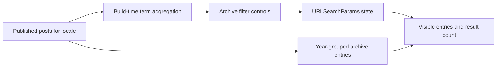

# Archives 分类筛选重构实现计划

## 1. 背景

当前 `dev` 分支已经通过提交 `e5f4fa5` 回退 resume、series 以及后续通用 taxonomy 重构，文件 tree 与 `9e68f38530a385ba46b53b1cb7da71ddf1c149fd` 一致。

Baseline 中已有以下行为：

- `posts`、`projects`、`pages` 三个 Astro Content Collections。
- `tags` 位于公共 `baseSchema`，因此三个集合理论上都拥有 tags。
- `/archives/` 只查询 posts，并按年份展示时间线。
- `/tags/` 与 `/tags/[tag]/` 是 posts-only 静态页面。
- Post 详情页中的 tag 链接指向独立 tag 详情页。
- Sitemap 单独发现 tags 并生成 taxonomy URL。
- RSS 只输出 posts。

此前的重构尝试把 taxonomy 泛化为 content type 下的公开二级能力，并引入 term metadata、localized slug、通用 capability route 和 series entity。该实现能够表达复杂关系，但对当前内容型主题的实际使用场景过重：用户为了给文章添加 tags/categories，需要理解 content type owner、稳定 ID、localized metadata 和多层能力路由。

本计划重新从用户浏览行为出发：Archives 是 posts 的时间归档页，tags/categories 是归档结果的筛选维度，而不是必须拥有独立公开页面的资源。

## 2. 目标

在保持 Astro 静态输出和 compact reading layout 的前提下：

1. `/archives/` 继续只展示当前 locale 的公开 posts。
2. Archives 顶部提供 Categories 和 Tags 筛选器。
3. Categories 单选、Tags 单选；两者同时存在时使用 AND。
4. 筛选状态写入 URL query，支持分享、刷新、浏览器前进和后退。
5. Tag/category term 从当前 locale 的公开 posts 自动发现，无需注册文件。
6. Post 详情中的 tag/category 链接进入带 query 的 Archives。
7. 删除独立 tags 索引页、tag 详情页及其导航、sitemap 输出。
8. Projects 不进入 Archives；projects tags 保留为项目自身元信息。
9. Pages 不拥有 tags/categories。
10. 不重新引入 resume、series 或通用 taxonomy capability framework。

## 3. 领域边界

### 3.1 Posts

Posts 是按发布日期组织的文章内容，拥有：

- `tags: string[]`
- `categories: string[]`
- `pubDate: Date`
- Archives 展示资格

Tags 和 categories 均为当前 locale 内的展示文本。它们不承担跨 locale 稳定身份，不生成 locale alternate，也不要求额外 label/slug metadata。

### 3.2 Projects

Projects 是作品集内容，拥有：

- `tags: string[]`
- `featured`
- `links`
- 自身的 card/list layout

Projects 不进入 Archives。第一阶段不在 `/projects/` 增加筛选器，但保留 tags，以便卡片展示、搜索以及未来在 Projects 页面复用筛选组件。

### 3.3 Pages

Pages 是普通页面内容：

- 不进入 Archives。
- 不拥有 tags/categories。
- Resume 若未来需要，只作为普通 Markdown page 内容，不扩展核心 schema。

### 3.4 Series

Series 是文章之间的有序关系，不属于 taxonomy。本轮不实现 series 字段、路由、导航或界面。

未来确有真实内容需求时，应单独规划 posts-only 的轻量模型，不与 Archives taxonomy 混合实施。

## 4. 信息架构

### 4.1 保留的公开路由

```text
/
/posts/
/posts/<slug>/
/projects/
/projects/<slug>/
/archives/
/about/
/timeline/
/rss.xml
```

非默认 locale 继续使用既有 locale 前缀，例如：

```text
/zh-cn/archives/
```

GitHub Pages 项目部署继续通过 `getLocalePath()` 和 `ASTRO_BASE` 处理 base。

### 4.2 删除的公开路由

```text
/tags/
/tags/<tag>/
/zh-cn/tags/
/zh-cn/tags/<tag>/
```

不提供兼容 alias 或 redirect。当前主题尚未发布，无需维护旧 URL 合同。

### 4.3 Archives query 合同

支持以下参数：

```text
/archives/?category=Guides
/archives/?tag=Astro
/archives/?category=Guides&tag=Astro
```

规则：

- 参数值使用对应 locale 内容中的原始展示文本，通过 `URLSearchParams` 编解码。
- Category 与 Tag 各最多一个有效值。
- 两个参数同时有效时使用 AND。
- 缺少参数表示该维度为 All。
- 未知或空参数视为 All，并使用 `history.replaceState()` 清理无效 query。
- 筛选变更使用 `history.pushState()`，不触发页面重新加载。
- `popstate` 必须重新应用 UI 和结果状态。
- 不把筛选 query 写入 sitemap。

## 5. Authoring Contract

### 5.1 Posts frontmatter

```yaml
---
title: Astro Narrow Theme Guide
pubDate: 2026-06-27
categories:
  - Guides
tags:
  - Astro
  - Markdown
---
```

### 5.2 Projects frontmatter

```yaml
---
title: Astro Narrow
tags:
  - Astro
  - Content
featured: true
---
```

### 5.3 多语言约定

Term 是 locale-local display value：

```yaml
# English post
categories: [Guides]
tags: [Astro, Theme]

# Chinese post
categories: [指南]
tags: [Astro, 主题]
```

原因：

- Archives 每次只查询一个 locale。
- 不再生成独立 term 页面。
- 不需要跨语言保持同一 term URL。
- 直接使用作者输入能避免 metadata registry 和重复配置。

此取舍意味着 taxonomy term 不再具备独立 description、cover、自定义 slug 或 SEO landing page。若未来产品需求明确要求这些能力，应另行规划，而不是在本实现中预留抽象。

## 6. Schema 设计

`src/content.config.ts` 调整为集合专属字段：

```ts
const baseSchema = z.object({
  title: z.string(),
  description: z.string().optional(),
  pubDate: z.coerce.date().optional(),
  updatedDate: z.coerce.date().optional(),
  draft: z.boolean().default(false),
  cover: z.string().optional(),
  lang: z.enum(['en', 'zh-cn']).optional(),
  // 其余通用 Markdown/UI 字段
});

const posts = defineCollection({
  schema: baseSchema.extend({
    pubDate: z.coerce.date(),
    tags: z.array(z.string().trim().min(1)).default([]),
    categories: z.array(z.string().trim().min(1)).default([])
  })
});

const projects = defineCollection({
  schema: baseSchema.extend({
    tags: z.array(z.string().trim().min(1)).default([]),
    // links / featured
  })
});

const pages = defineCollection({
  schema: baseSchema.extend({
    layout: z.enum(['page', 'timeline']).default('page')
  })
});
```

约束：

- 不新增 taxonomy 配置注册表。
- 不新增 data collection。
- 不新增 `taxonomy-terms.yaml`。
- 不新增运行时 schema 或第三方依赖。
- Categories/tags 允许一个条目拥有多个值，但筛选 UI 每个维度只允许选择一个值。

## 7. 数据流



构建期负责：

- 过滤 draft。
- 按 locale 查询 posts。
- 按发布日期降序排列。
- 聚合 tags/categories 及其总计数。
- 渲染所有归档条目和筛选按钮。

浏览器脚本只负责：

- 读取/写入 query。
- 切换按钮状态。
- 隐藏或显示已渲染条目。
- 隐藏无可见条目的年份 section。
- 更新结果数量和空状态。

脚本不得成为内容数据权威，也不得在客户端重新请求内容 API。

## 8. Term 聚合规则

新增或调整纯 helper，从 posts 中收集指定字段：

```ts
type ArchiveTerm = {
  value: string;
  count: number;
};
```

处理规则：

1. 去除字段值首尾空白；schema 已拒绝纯空白字符串。
2. 同一 entry 内重复 term 只计数一次，避免错误 frontmatter 放大计数。
3. 匹配保持大小写敏感，展示值与 authoring value 一致。
4. Categories 按当前 locale 的 `Intl.Collator` 排序。
5. Tags 先按 count 降序，再按当前 locale label 排序。
6. Draft 和其他 locale 不参与 term 发现或计数。

第一阶段不实现同义词、大小写合并、层级 category 或 term alias。

## 9. Archives UI

### 9.1 页面结构

```text
Archives                                      24 posts
All posts ordered by publication date.

Categories
[ All 24 ] [ Guides 8 ] [ Notes 10 ] [ Essays 6 ]

Tags
[ All 24 ] [ Astro 7 ] [ Markdown 4 ] [ Theme 3 ]

Showing 5 posts

2026
──────────────────────────────────────────────
Jun 28   Markdown Features in Astro Narrow
Jun 27   Astro Narrow Theme Guide
```

### 9.2 交互规则

- Filter controls 使用原生 `<button type="button">`。
- 当前选中项使用 `aria-pressed="true"`。
- 每个维度包含 All 按钮。
- 点击同一个已选 term 不切换为未选；清除该维度使用 All，避免状态不明显。
- Results count 使用 `aria-live="polite"`。
- 无结果时显示本地化 empty state。
- 所有交互目标最小高度 44px。
- Focus ring 使用既有 primary/theme token。
- 不使用布局位移 hover，不新增连续动画。
- Filter 控件默认带 `hidden`；脚本初始化成功后再显示。无 JavaScript 时用户仍看到全部 Archives，而不是不可操作的控件。

### 9.3 响应式

- 375px：chips 自动换行，时间线保留现有紧凑结构。
- 768px 以上：Category/Tag label 与 chips 可使用两列 label-content grid，但不建立侧栏。
- 不使用横向滚动作为主要 filter 浏览方式。
- 年份和 entry 的现有视觉层级保持不变，只做筛选所需的语义标记。

## 10. DOM Contract

Archive timeline 输出稳定的 data attribute：

```html
<section data-archive-year="2026">
  <a
    data-archive-entry
    data-categories='["Guides"]'
    data-tags='["Astro","Markdown"]'
  >
    ...
  </a>
</section>
```

要求：

- 数组使用 `JSON.stringify()` 写入 attribute，由浏览器脚本 `JSON.parse()`。
- 不使用逗号拼接，避免 term 自身包含逗号时解析错误。
- Entry link 仍是正常 `<a>`，筛选脚本只操作其 `hidden` 属性。
- Year section 在全部子项隐藏时同步设置 `hidden`。

## 11. PostMeta 链接

Post 详情页同时展示 categories 和 tags：

```text
Categories  Guides
Tags        #Astro  #Markdown
```

链接规则：

```text
Guides   -> /archives/?category=Guides
Astro    -> /archives/?tag=Astro
```

实现必须先调用 `getLocalePath(locale, '/archives/')`，再通过 `URLSearchParams` 附加 query，确保 locale 与 `ASTRO_BASE` 正确。

新增共享 helper 时仅负责生成 Archive filter URL，不建立通用 taxonomy route builder。

## 12. Projects 策略

第一阶段：

- Projects 保持现有 `/projects/` 网格和详情页。
- Project tags 继续显示在 card，并进入 search index。
- Project tags 不链接到 posts Archives。
- 不生成 project tag 页面。
- 不把 project entries 混入 Archives 时间线。

未来 projects 数量达到需要筛选的程度时，可以复用 term aggregation 和 filter script，但应在 `/projects/` 内提供独立筛选状态，不能通过扩大 Archives 语义完成。

## 13. Search、Sitemap 与 RSS

### 13.1 Search

`src/pages/api/search.json.ts`：

- Posts：继续输出 tags，并新增 categories。
- Projects：继续输出 tags，categories 为空。
- Pages：tags/categories 均为空。
- 前端 Fuse keys 增加 categories。
- Search 结果仍只有内容条目，不新增 taxonomy 结果。

### 13.2 Sitemap

`src/pages/sitemap.xml.ts`：

- 删除 `/tags/` 静态路径。
- 删除所有 tag detail 路径发现逻辑。
- 保留 home、posts、projects、archives、RSS 和内容详情 URL。
- 不枚举 Archives query 组合。
- 继续使用 `getLocalePath()` 处理 locale/base。

### 13.3 RSS

RSS 保持 posts-only，除非 tags/categories schema 调整造成类型回归，否则不修改产品行为。

## 14. Navigation

`src/config/navigation.ts`：

- 删除 `tags` system route。
- 保留 `archives` system route。

`src/config/site.ts` 示例配置：

```ts
nav: ['posts', 'projects', 'archives'],
footerNav: ['archives']
```

不自动为 categories/tags 创建导航项。

## 15. i18n 文案

新增英文与简体中文文案，至少覆盖：

- Categories / 分类
- Tags / 标签
- All / 全部
- Showing N posts / 显示 N 篇文章
- No posts match these filters / 没有符合筛选条件的文章
- Clear filters / 清除筛选（若最终 UI 保留总清除按钮）

删除只服务于独立 tags 页面或 tag detail page 的过时文案。

动态数量不要通过字符串拼接形成难以本地化的完整句子。实现可以让翻译函数接受简单占位，或在 Archives 组件内按 locale 生成完整结果句；不得扩展成通用 i18n 框架重构。

## 16. 文件范围

### 必须修改

- `src/content.config.ts`
- `src/lib/content/entries.ts`
- `src/pages/archives/index.astro`
- `src/pages/[locale]/archives/index.astro`
- `src/components/content/ArchiveTimeline.astro`
- `src/components/content/PostMeta.astro`
- `src/pages/posts/[...slug].astro`
- `src/pages/[locale]/posts/[...slug].astro`
- `src/config/navigation.ts`
- `src/config/site.ts`
- `src/i18n/ui.ts`
- `src/pages/api/search.json.ts`
- `src/scripts/search.ts`
- `src/pages/sitemap.xml.ts`
- `README.md`
- `README.zh-CN.md`
- Posts/Projects 英文和中文示例内容

### 新增

- `src/components/content/ArchiveFilters.astro`
- `src/scripts/archive-filters.ts`

### 删除

- `src/pages/tags/index.astro`
- `src/pages/tags/[tag].astro`
- `src/pages/[locale]/tags/index.astro`
- `src/pages/[locale]/tags/[tag].astro`
- `src/components/content/TermCloud.astro`（确认无其他调用后删除）

### 默认不修改

- `src/config/content.ts`：本轮不把 taxonomy 重新注册到 content type config。
- `src/lib/content/rss.ts`
- Markdown remark/rehype 插件
- 主题 token 和主题列表
- Projects 页面布局
- Pages 页面布局

## 17. 实施单元

### U1. 收紧 schema 与迁移示例内容

1. 从 `baseSchema` 移除 tags。
2. Posts 增加 tags/categories。
3. Projects 增加 tags。
4. Pages 不再拥有 taxonomy 字段。
5. 为中英文 posts 示例增加 categories。
6. 保留 projects tags 示例。

验证：`pnpm build` 能读取所有 collections，生成内容类型保持正确。

### U2. 建立 Archives term aggregation

1. 在 `src/lib/content/entries.ts` 增加 posts term 聚合 helper。
2. Helper 不导入浏览器 API，不依赖页面组件。
3. Default/locale Archives 页面分别计算 categories/tags。
4. 将 terms 与 posts 传给 `ArchiveFilters`/`ArchiveTimeline`。

验证：英文和中文各自只发现当前 locale 的公开 terms，draft 不计数。

### U3. 实现渐进增强筛选器

1. 新建 `ArchiveFilters.astro`，输出隐藏的语义化 button controls、结果数量和 empty state。
2. 为 Archive entry/year 添加 DOM data contract。
3. 新建 `archive-filters.ts`，实现 query 初始化、筛选、pushState 和 popstate。
4. 保持无 JS 时全部内容可见。

验证：从 query 加载、点击筛选、All、组合筛选、前进/后退和空状态均符合合同。

### U4. 将 PostMeta taxonomy 链接迁移到 Archives

1. PostMeta 增加 categories props。
2. 默认和 localized post detail route 传入 categories。
3. Tags/categories 链接指向 locale/base-aware Archives query。
4. 保持现有日期、panel 和响应式样式。

验证：默认语言、中文和项目 base 下链接正确。

### U5. 删除独立 taxonomy 页面并对齐派生输出

1. 删除四个 tags route。
2. 删除无引用 TermCloud。
3. 从 navigation/site config 移除 tags 项。
4. Sitemap 删除 taxonomy URL。
5. Search 增加 categories，保持 projects tags。
6. 清理独立 tags 页面 i18n 文案和 helper。

验证：构建产物不存在 `/tags/`，Archives、Search、Sitemap、RSS 仍正常生成。

### U6. 更新文档并完成构建验收

1. README 中英文同步说明 posts categories/tags 和 Archives 筛选。
2. 删除独立 Tags 页面说明。
3. 明确 Projects 不进入 Archives。
4. 执行全部构建与产物审计。

## 18. 构建验证

按用户要求，本实现不新增测试文件或测试脚本，只使用构建与生成产物审计。

### 普通构建

```sh
pnpm build
```

### GitHub Pages base 构建

```sh
ASTRO_BASE=/astro-narrow/ pnpm build
```

### 绝对 URL 构建

```sh
ASTRO_SITE=https://example.com ASTRO_BASE=/astro-narrow/ pnpm build
```

### Diff 检查

```sh
git diff --check
```

### 生成产物审计

检查：

- `/archives/` 与 `/zh-cn/archives/` 存在。
- `/tags/` 与 `/zh-cn/tags/` 不存在。
- Archives HTML 含 categories/tags filter controls 和 entry data attributes。
- Default locale 不带 `/en/`。
- 中文路径带 `/zh-cn/`。
- 带 base 构建中的 PostMeta filter href 包含 `/astro-narrow/`。
- Search JSON 中 posts 有 categories，projects tags 保留，pages 无 taxonomy。
- Sitemap 不包含 `/tags/` 或 query URL。
- RSS 仍只包含 posts，URL 无重复 base。

## 19. 验收场景

### A1. Category 筛选

给定英文 posts 使用 `Guides` 与 `Notes`，打开 `/archives/?category=Guides` 时：

- Guides 按钮处于 pressed 状态。
- 只显示 Guides posts。
- 无结果年份被隐藏。
- 结果数量正确。

### A2. Tag 筛选

打开 `/archives/?tag=Astro` 时只显示包含 Astro 的 posts，term count 仍表示该 locale 的公开总数。

### A3. 组合筛选

打开 `/archives/?category=Guides&tag=Markdown` 时，仅显示同时满足两个条件的 posts。

### A4. 多语言

中文 Archives 只发现中文 posts 中的分类文本；`指南` 不依赖英文 `Guides` metadata。

### A5. PostMeta deep link

点击中文文章的 `主题` tag 后进入 `/zh-cn/archives/?tag=<encoded value>`，筛选状态自动恢复。

### A6. Projects 边界

Project entry 不出现在 Archives；project tags 仍出现在项目卡片和搜索关键词中。

### A7. 渐进增强

禁用 JavaScript 时 Archives 显示全部 posts，筛选 controls 不显示，不出现空白页面或不可操作控件。

### A8. 无效 query

打开 `/archives/?tag=missing` 时按 All 处理并清理无效参数，不错误显示永久空结果。

## 20. 明确排除

本轮不实现：

- Hierarchical categories。
- 多 tag 同时选择。
- Tag/category AND/OR 模式切换。
- 独立 taxonomy 详情页。
- Taxonomy SEO landing page。
- Term description、cover、自定义 slug、alias。
- Cross-locale term identity。
- Projects Archives 聚合。
- Projects 筛选 UI。
- Series。
- Resume schema/layout。
- 服务端或运行时内容 API。
- 新依赖。
- 自动化测试文件。

## 21. 风险与控制

### Query URL 包含 Unicode

使用 `URLSearchParams`，不手写字符串拼接；浏览器负责正确编码与解码。

### Term 包含特殊字符

DOM attribute 使用 JSON 数组，query 使用标准 URL 编码，不使用逗号、空格或自定义分隔符。

### JavaScript 初始闪烁

静态页面先展示全部内容，脚本初始化后应用 query。内容量较小时该行为可接受；不通过 inline blocking script 提前隐藏页面。

### Search 与 schema 类型回归

Pages 移除 tags 后，Search 必须使用字段存在性判断或按 collection 显式映射，不能假设所有 data 都有 tags/categories。

### Sitemap base 错误

删除 taxonomy 路径逻辑后仍统一使用 `getLocalePath()`；必须执行 base 与 site+base 构建审计。

### 过早泛化

Term helper 可以接受 field 参数以复用 tags/categories，但不得建立 capability registry、route manifest 或 metadata collection。只有 Projects 真正需要筛选时，才把 Archives 浏览器逻辑抽成跨页面通用模块。

## 22. 完成标准

- Posts 拥有 tags/categories，Projects 只拥有 tags，Pages 无 taxonomy。
- Archives 保持 posts-only，并支持 category/tag 单选组合筛选。
- 筛选状态可分享、可刷新、支持前进/后退。
- PostMeta taxonomy 链接进入 Archives query。
- 独立 `/tags/` 页面、导航与 sitemap 输出被删除。
- 仓库不存在 taxonomy metadata registry、series 或 resume 专属实现。
- README、中英文示例和 schema 一致。
- 普通、base、site+base 构建成功。
- 生成产物审计符合第 18 节。
- 没有新增依赖、测试文件、兼容 alias 或无关重构。
