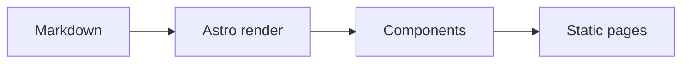

## Why Astro

Astro Narrow uses content collections, Astro components, and a Markdown pipeline
instead of Hugo templates. The implementation is intentionally native to Astro:
routes are generated from collections, Markdown is enhanced with remark/rehype,
and interactive pieces hydrate only where they are useful.

> [!NOTE]
> This alert is written with GitHub-style blockquote syntax.

## Typography

Good writing pages need a stable rhythm. This paragraph includes an
[internal-style link](/posts/) and enough text to check line height, wrapping,
and color contrast in both light and dark mode.

### Lists

- Content collections provide typed frontmatter.
- Astro components keep layout boundaries explicit.
- Small client scripts handle search, theme switching, galleries, and TOC.

1. Write Markdown.
2. Let Astro render content.
3. Enhance only the pieces that need interaction.

### Table

| Feature | Implementation                                  |
| ------- | ----------------------------------------------- |
| Search  | Fuse.js over a static JSON index                |
| Code    | Astro Expressive Code                           |
| Gallery | Build-time Markdown grouping plus smart-gallery |
| Theme   | CSS variables with light and dark axes          |

## Code

```ts title="theme.ts" {5} ins={2} del={3}
type ThemeMode = "light" | "dark";
const defaultMode: ThemeMode = "light";
const defaultMode: ThemeMode = "auto";

export function setTheme(mode: ThemeMode) {
  document.documentElement.classList.toggle("dark", mode === "dark");
}
```

```astro title="AuthorCard.astro" {6-8}
---
const title = 'Astro component';
---

<section class="surface-card">
  <h2>{title}</h2>
  <slot />
</section>
```

```diff lang="ts" title="content-schema.diff"
 const posts = defineCollection({
-  schema: oldPostSchema
+  loader: glob({ base: './src/content/posts', pattern: '**/*.{md,mdx}' }),
+  schema: postSchema
 })
```

```bash title="terminal"
pnpm install
pnpm build
```

```json title="theme.json" {2-3}
{
  "theme": "default",
  "colorMode": "dark",
  "features": ["search", "toc", "gallery"]
}
```

```css title="tokens.css" {2}
:root {
  --radius: 0.75rem;
  --color-background: oklch(1 0 0);
}
```

```ts title="collapsible-example.ts" collapse={1-6, 20-24}
import { getCollection } from "astro:content";
import { siteConfig } from "../config/site";
import { formatDate } from "../lib/content/entries";

const posts = await getCollection("posts");
const locale = "en";

export function summarize() {
  return posts.map((post) => ({
    title: post.data.title,
    description: post.data.description,
    date: formatDate(post.data.pubDate, locale),
    site: siteConfig.name,
  }));
}

console.log(summarize());

function unusedDebugHelper() {
  console.log("This section starts collapsed.");
  console.log("Use it to inspect long code blocks.");
  console.log("Expressive Code keeps the reading flow compact.");
}
```

## Single Image


## Gallery

The following images are written as consecutive Markdown images, so they become
one gallery.


## Math

Inline math works as $E = mc^2$.

$$
\int_0^1 x^2 dx = \frac{1}{3}
$$

## Mermaid



## Alerts

> [!TIP]
> Use consecutive Markdown images when you want a gallery without custom syntax.

> [!WARNING]
> External image dimensions may not be known at build time, so the gallery uses
> conservative defaults before the browser loads the images.
